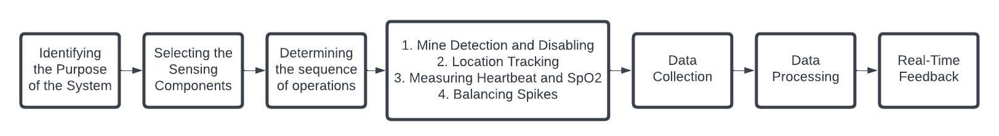
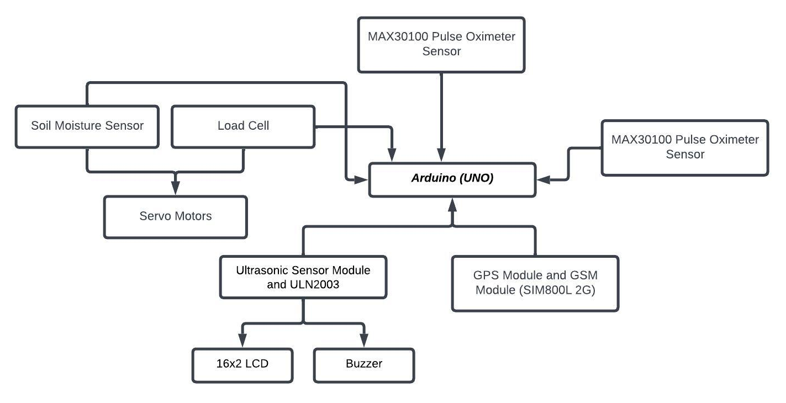

# Smart-Military-Shoe
Design and implement a smart military shoe system to enhance soldiers’ situational awareness and give them real-time feedback. This system has been implemented on a shoe with some sensors and hardware components. Such as - GPS module, soil moisturizer sensor, ultrasonic sensor, etc. This military shoe system offers several important features such as - mine detection and disabling, location tracking, measuring Heartbeat and SpO2, and balancing spikes. Overall the smart military shoe will represent a hopeful performance and safety for soldiers.

## System Diagram

